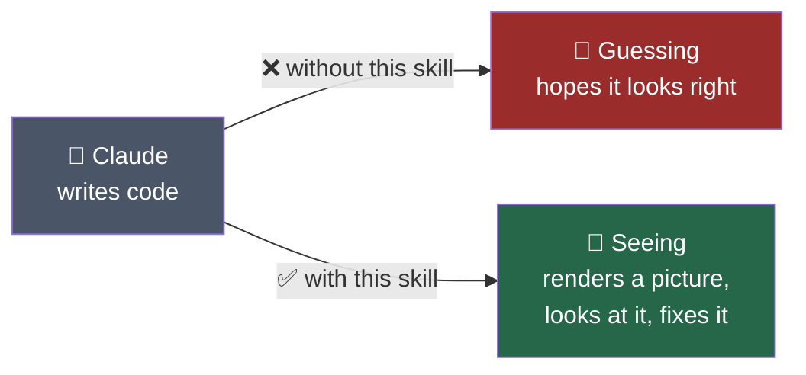
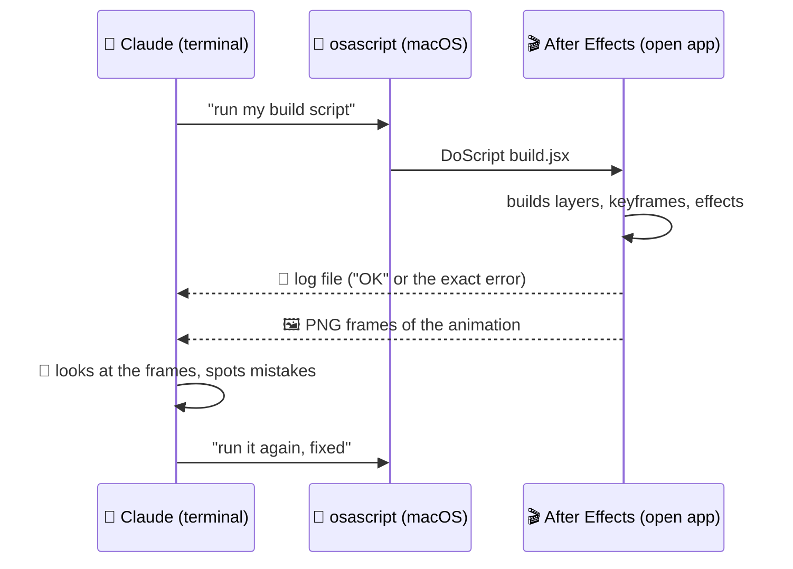
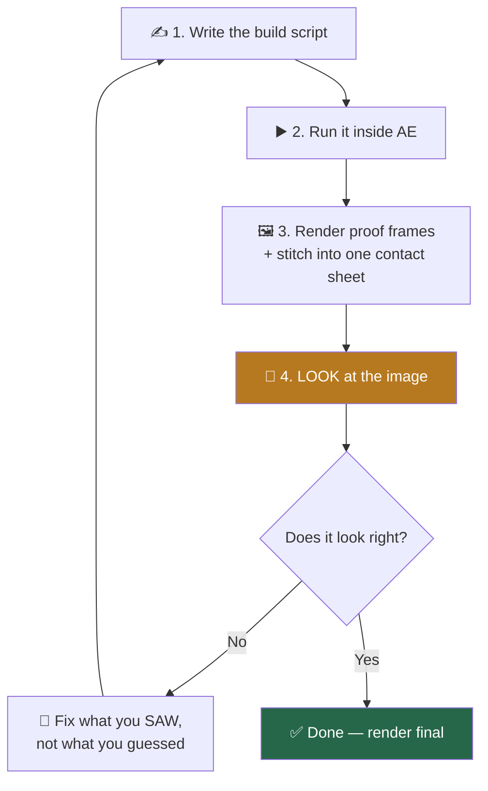
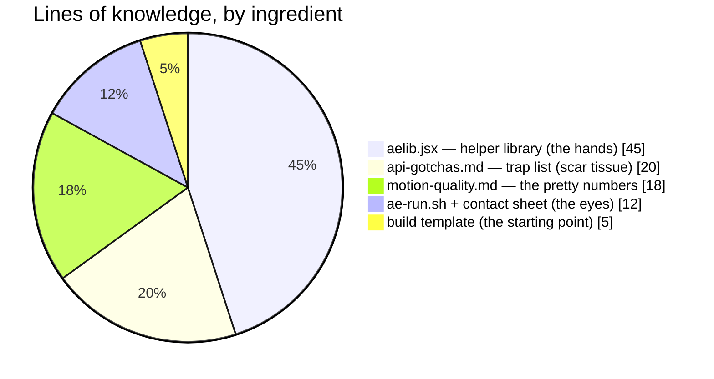
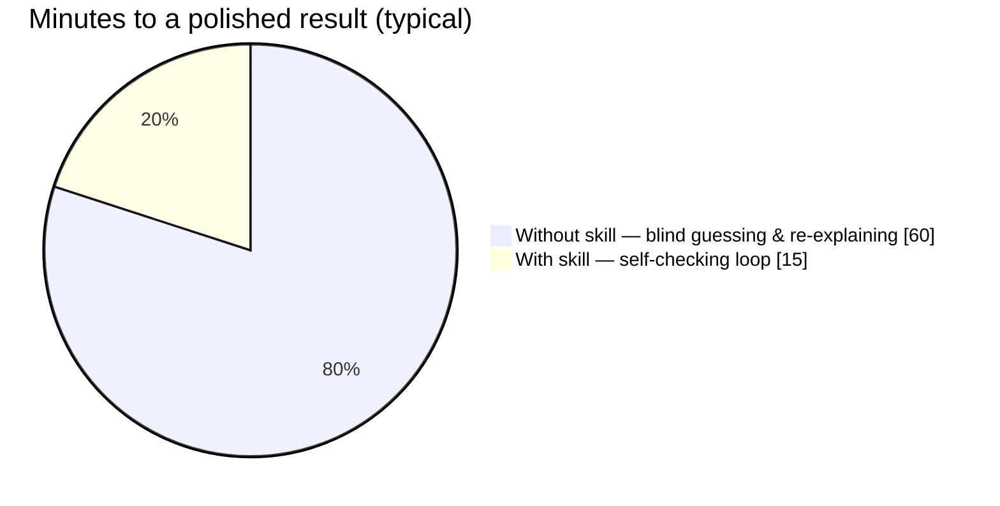
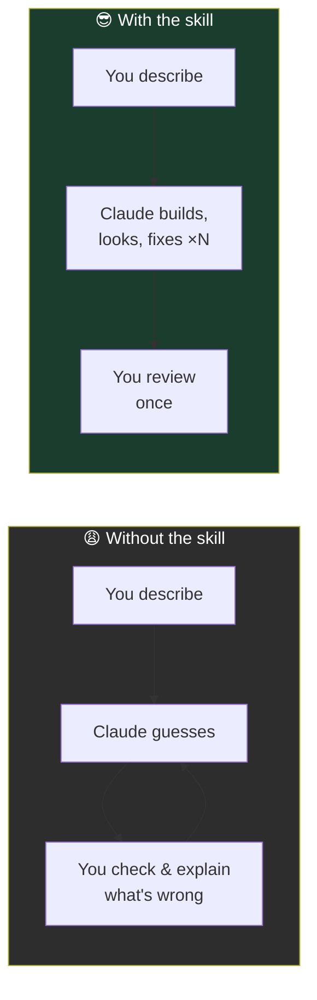
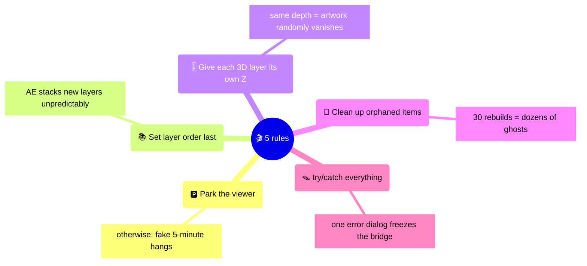

# 🎬 What the After Effects Skill Actually Does — In Pictures

> **One sentence:** it gives Claude **hands** (scripts that control After Effects) and **eyes** (rendered frames it can look at) — so it can build motion graphics and *check its own work*.

---

## 🧠 First principles: the core problem

Claude can write animation code, but After Effects is a **visual** program. Code that *looks* correct often *renders* wrong. The skill closes that gap:

---

## 🌉 The bridge: how Claude talks to After Effects

No plugin. No extension. Just one built-in macOS command connecting the terminal to the running app:

---

## 🔁 The loop: the skill IS this cycle

Every improvement comes from repeating one simple cycle — like an editor scrubbing the timeline after every change:

---

## 📦 What's in the box

| Piece | In plain words |
|---|---|
| 🛠️ `aelib.jsx` | Shortcuts for everything: shapes, easing, cameras, cleanup |
| ⚠️ `api-gotchas.md` | Every way AE silently fails, so it's only discovered once |
| ✨ `motion-quality.md` | The exact numbers that make motion look **expensive** |
| 👁️ `ae-run.sh` | One command: build → render → one big image to look at |

---

## ⏱️ Why it helps: time spent per animation

Fewer round-trips with the human, because Claude catches its own mistakes **before** showing you anything:

---

## 🏆 The five hard-won rules (learned the painful way)

---

*Companion to [`after-effects-scripting`](../after-effects-scripting) — the actual skill this explains.*
